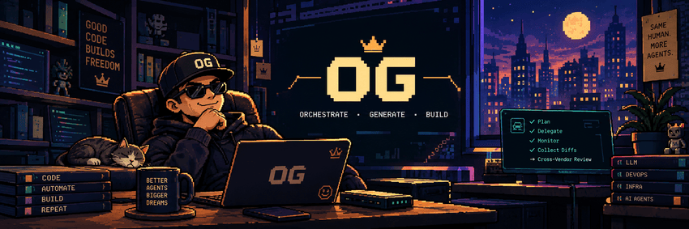

<h1> OG</h1>

A reproducible multi-agent coding setup on top of [Omnigent](https://omnigent.ai).

<p align="center">
  
</p>

One orchestrator plans and delegates. Several coding agents — from *different
vendors* — implement in isolated git worktrees. A different-vendor reviewer
judges the batched diff. Policies, not prompts, enforce what may be merged.

[](https://www.python.org/)
[](https://github.com/jmvbambico/og/actions/workflows/tests.yml)
[](https://github.com/jmvbambico/og/releases)
[](http://www.wtfpl.net/about/)

`og` is the control script (server + ngrok tunnel + agent registration);
`install.sh` is the interactive installer that generates the agent bundle for
whichever CLIs you actually have.

```
./install.sh        # pick your agents, write the config
og start            # run it
```

---

## Why this exists

Omnigent gives you the runtime. This repo is the *opinionated setup on top*:

- **Cross-vendor review by construction.** The implementer and the reviewer are
  never the same model family, because same-vendor review shares blind spots.
- **Mechanism over prompt.** "Never merge to `main`" is a policy that returns
  DENY, not a sentence in a system prompt a model can reason past.
- **Free tiers first.** Workers are ordered by preference so day-capped free
  models get used before paid ones.
- **Reproducible.** Every choice lives in one JSON file. Re-running the
  installer on another machine reproduces the setup.

---

## Architecture

```
                 you (terminal, or phone via the ngrok URL)
                                  │
                          ┌───────▼────────┐
                          │  og  (bash)    │  tunnel → server → register agent
                          └───────┬────────┘
                                  │
                    ┌─────────────▼──────────────┐
                    │   Omnigent server :6767    │
                    │   ├ policy engine          │◄── policies/
                    │   └ host daemon → runner   │
                    └─────────────┬──────────────┘
                                  │  sys_session_send
                  ┌───────────────┼───────────────┐
                  │               │               │
        ┌─────────▼──────┐ ┌──────▼───────┐ ┌─────▼────────┐
        │  ORCHESTRATOR  │ │   CODER #1   │ │   REVIEWER   │
        │  plans, never  │ │  worktree A  │ │  reads diff  │
        │  writes code   │ │   ...#2 B    │ │  never edits │
        └────────────────┘ └──────────────┘ └──────────────┘
             vendor X          vendor Y,Z        vendor ≠ Y,Z

   worktrees:  ~/projects/.worktrees/<repo>/<task>   (one per coder, parallel)
   delivery:   feature/* ──merge──► integration/* ──gate once──► one PR
```

**The flow.** The orchestrator decomposes a goal, creates a worktree per task,
dispatches coders in parallel, collects their commits onto one integration
branch, runs the full gate there exactly once, sends the combined diff to the
reviewer, and opens a single PR. It writes no product code itself.

**Where the rules come from.** Nothing above is hardcoded per project. Each
repo carries its own `AGENTS.md` (the constitution) and optionally
`.agents/orchestration.yaml` (machine-readable branches, gate commands,
`never_write` paths, merge policy). One global agent serves every project.

---

## What gets installed

| Path | What |
|---|---|
| `<bin_dir>/og` | control script — you choose where (default: first of `~/.local/bin` / `~/bin` already on `PATH`) |
| `~/.omnigent/agents/<name>/config.yaml` | orchestrator (generated) |
| `~/.omnigent/agents/<name>/agents/*/config.yaml` | one per coder + reviewer (generated) |
| `~/.omnigent/agents/<name>/skills/` | `fanout`, `cross-review`, `investigate`, `roster` |
| `~/.omnigent/policies/omnigent_local_policies.py` | merge gate + branch-cleanup blast radius |
| `<omnigent venv>/site-packages/omnigent-local-policies.pth` | puts that directory on **omnigent's** `sys.path` (resolved from the `omnigent` entry point, verified by importing) |
| `~/.omnigent/config.yaml` | patched: `policy_modules`, `acp.agents`, `default_agent` |
| `~/.omnigent/opencode/opencode.json` | OpenCode worker overrides: drops the blocking `question` tool; wires a code-intelligence MCP (e.g. CodeGraph) when its CLI is on PATH. Only when OpenCode is a coder, not the orchestrator |
| `~/.omnigent/og.env` | `OG_AGENT`, `OG_PORT`, ngrok domain, reviewer account, `OG_AUTO_UPDATE` |
| `~/.omnigent/og-install.json` | **your choices — the source of truth** |

The YAML bundles are *generated artifacts*. Edit `og-install.json` and re-run,
or just re-run the installer; hand edits to the generated YAML survive only
until the next run.

---

## Requirements

**Platforms.** macOS and Linux natively; **Windows via WSL2** (Ubuntu is the
tested distro). Native Windows — PowerShell, cmd, Git Bash — is not supported:
`og` is a bash script and Omnigent's native agent terminals need `tmux`. See
[Windows (WSL2)](#windows-wsl2) for the two things that differ there.

**Required**

| | Why | macOS | Linux / WSL |
|---|---|---|---|
| `omnigent` | the runtime this configures | `uv tool install omnigent` | same |
| `python3` + PyYAML | installer; Omnigent's venv already has it | preinstalled | `sudo apt install python3` |
| `tmux` | native agent terminals run inside it | `brew install tmux` | `sudo apt install tmux` |
| `git` | worktrees for parallel workers | `xcode-select --install` | `sudo apt install git` |

**Per workflow** — `./install.sh --check` reports these but does not fail on them

| | Why |
|---|---|
| `gh` | only for projects hosted on GitHub whose delivery ends in a PR: the orchestrator opens it, and the merge gate reads the review marker from its body. Without it the gate denies protected-branch merges (the safe side); everything else — dispatch, worktrees, review — runs as normal. |
| `ngrok` | only for `og start tunneled`: a public URL so you can drive a run from outside your network. A *reserved domain* keeps invite links and session cookies working across restarts. |
| `qrencode` | prints the tunnel URL as a QR block |

**At least one coding CLI.** Run `./install.sh --check` to see what you have.

---

## Supported agents

`installer/registry.json` is the catalog — adding a vendor is a row, not code.

| Agent | Harness | Roles | Model pin | Notes |
|---|---|---|---|---|
| Claude Code | `claude-native` | orch / coder / reviewer | optional | multi-account via `CLAUDE_CONFIG_DIR` |
| OpenCode (Zen) | `opencode-native` | orch / coder | **required** | lists every provider you've added with `opencode auth login` (Zen, DeepSeek, Anthropic, …); Zen's free `-free` lineup rotates and is day-capped |
| Codex | `codex-native` | orch / coder / reviewer | optional | |
| Cline | `acp:cline` | coder | **required** | leaf worker; **fails silently on a bad model**; runs with `--auto-approve true` (see below) |
| Kilo Code | `acp:kilo-code` | coder | **required** | via `kilo acp`; unverified here |
| Kiro (AWS) | `acp:kiro-aws` | coder / reviewer | optional | via `kiro-cli acp --trust-all-tools` (see below); 50 free credits/mo; unverified here |
| Cursor | `cursor-native` | coder / reviewer | optional | |
| Antigravity | `antigravity-native` | coder / reviewer | optional | prompt **not delivered** — see below |
| Goose, Hermes, Gemini, Grok, Devin | various | coder | optional | |

### Four properties worth understanding

**Cline runs with `--auto-approve true`.** Cline's ACP mode (used for editor
integration, which is how it's invoked here) defaults tool auto-approval to
`false` — so unlike this repo's other harnesses, it prompts for approval on
every file edit and command by default, which drowns a headless worker in
requests no one is present to answer. Omnigent's own policy layer (the merge
gate, blast-radius guardrails) is what actually gates risky operations
regardless of this setting, so disabling Cline's own redundant per-action
prompt does not widen what a worker can get away with — it only removes
friction Omnigent's own guardrails already cover. Set via `acp_command` in
`installer/registry.json`, which the installer writes into
`~/.omnigent/config.yaml`'s `acp.agents[].command`.

**Kiro runs over ACP, not `kiro-native`, with `--trust-all-tools`.** Omnigent
does have a first-class `kiro-native` harness, but its headless-worker seam —
the one that hands Claude `--permission-mode`, Codex
`--dangerously-bypass-approvals-and-sandbox`, Cursor `--yolo` — has no entry
for Kiro. A native Kiro worker therefore asks for permission on every tool and
leans on a tmux "permission mirror" that, in practice, fails to deliver the
verdict (`permission prompt was not safely focused before verdict delivery`),
so the worker just sits there. `kiro-cli acp --trust-all-tools` lets Kiro answer
its own prompts, and the ACP worker's `permission_mode: bypassPermissions`
covers whatever it relays; the same Omnigent policies gate the rest. The
`acp:<slug>` harness id must be exactly what Omnigent derives from the row's
name (`Kiro (AWS)` → `kiro-aws`, `Kilo Code` → `kilo-code`): a wrong slug does
not error, it silently resolves to the *first* configured ACP row — a different
vendor. A test pins this.

**Model pin location.** A pin goes at `executor.model`. `executor.config` is a
free-form dict, so a `model:` placed there is accepted without complaint and
then silently ignored — the worker inherits the *orchestrator's* model id and
the dispatch fails. The installer always writes it to the right place.

**Prompt delivery.** Omnigent reports, per harness, whether a spec prompt
actually reaches the CLI:

- `argv` (Claude, Codex) — appended to the command line. Subject to a **tmux
  command-string ceiling of ~16 KB**, leaving ~13.3 KB for the prompt. The
  installer refuses to write a config that exceeds it.
- `per_turn` (OpenCode) — composed per turn over the harness's own transport.
  **No ceiling**, so this orchestrator supports a larger roster.
- `none` (Antigravity, Kiro, Cursor, Goose, Hermes, Gemini) — the harness
  **never receives the sub-agent prompt at all**. Such a worker sees only the
  dispatch text, so its operating rules must be inlined into every dispatch.
  The generated `roster` skill instructs the orchestrator to do that, and these
  harnesses are barred from the orchestrator role entirely.

---

## Install

Clone it wherever you keep repos — nothing depends on the location, and the
checkout is not consulted again after installing.

```bash
git clone git@github.com:jmvbambico/og.git
cd og
./install.sh --check      # what's present, what's missing
./install.sh              # pick agents, models, priority, reviewer
```

The installer will ask you to:

1. name the orchestrator bundle (default `dev-lead`)
2. pick which agent **orchestrates**
3. pick which agents **implement**, *in preference order* — the first is tried
   first, later ones absorb overflow
4. pin a **model** per coder — the installer runs the CLI's own listing
   (`opencode models`, `kilo models`), grouped by provider with free-tier ids
   first. Anything you've logged into with the CLI shows up: a DeepSeek key
   added via `opencode auth login` appears as `deepseek/…` next to Zen's
   `opencode/…` ids. Enter a number, or type a full id the list truncated.
   A login that yields no models (typically an OAuth *subscription* session,
   which OpenCode only routes through a vendor auth plugin) is called out with
   the fix — see [Troubleshooting](docs/TROUBLESHOOTING.md#opencode-a-provider-i-logged-into-is-missing-from-the-installers-model-list).
5. pick the **reviewer** — it warns if the reviewer shares a vendor with a
   coder. The vendor is read from the model pin where it says something
   (`opencode/claude-sonnet-5` is Anthropic, whoever bills for it), and from
   the registry otherwise
6. for Claude, whether the reviewer runs on a **second account**
   (`CLAUDE_CONFIG_DIR`, e.g. `~/.claude-work`) so it is independent of your
   interactive login
7. port (checked for availability — suggests a free one if the default is
   taken), ngrok domain, max dispatches per turn
8. **where the `og` command is installed** — defaults to a directory already on
   your `PATH` (`~/.local/bin` or `~/bin`), and warns if the one you choose
   isn't. Override without being asked via `OG_BIN_DIR=/some/bin ./install.sh`,
   or `"bin_dir"` in a plan.
9. whether `og start` should **auto-update** (default yes) — see
   [Updating](#updating). Off, it only warns when a newer og exists.

Then:

```bash
cd ~/projects/your-repo   # this becomes the default workspace
og start
```

## Reconfigure

Re-running is the supported way to change anything — orchestrator, a new coder,
a model, priority order, the reviewer:

```bash
og setup                # same as ./install.sh, from anywhere
./install.sh            # shows current config, then walks the same questions
./install.sh --show     # print current config, change nothing
```

Your previous answers are the defaults, so changing one thing means pressing
Enter through the rest. A running server keeps the old bundles until
`og restart`.

## Let an AI install it

```bash
./install.sh --questions        # decision schema + detected CLIs, as JSON
./install.sh --plan plan.json   # apply
./install.sh --plan plan.json --dry-run
```

See [AGENTS.md](AGENTS.md) for the instructions an AI should follow — it covers
what to ask the user, the constraints to respect, and how to verify the result.

---

## Using it

```
og start            serve on your LAN — QR points at this machine's network IP
og start tunneled   start ngrok first, then serve behind that public origin
og init [path]      scaffold a repo's orchestration contract
og stop             stop server, host daemons, tunnel
og restart [mode]   og stop, then og start — same arguments as start
og setup            re-run the installer: agents, models, reviewer, accounts
og status           what is running, and the URL
og chat             open an orchestrator session in this terminal
og url              print the URL (pipe-friendly)
og logs [-f]        tail the server log
og login            store server credentials (Keychain / keyring / 0600 file), once
og update           pull the checkout and re-apply the install
og version          print the installed version
```

`og login` is rarely something you run yourself: `og start` calls it for you the
first time there's no account to log into (see below).

**Where credentials go** depends on what the OS offers, best first:

| backend | when | where |
|---|---|---|
| `keychain` | macOS | the login Keychain, service `omnigent-og` |
| `secret-tool` | Linux with a Secret Service (GNOME Keyring, KWallet) | the default keyring, via libsecret |
| `file` | WSL, headless Linux, or a keyring that fails | `~/.omnigent/og-credentials`, mode `0600` |

Auto-detected; force one with `OG_CRED_BACKEND=<name>` in `~/.omnigent/og.env`.
The file backend is the floor, not a bug: it has the same protection as
`auth_tokens.json` beside it, which already holds a live session token.
`og status` shows which one is in use.

### local vs tunneled

**`og start` is local by default.** No tunnel, no ngrok account, nothing
exposed to the internet: the server binds `0.0.0.0` and the QR encodes
`http://<your-LAN-IP>:<port>`, which any device on the same wifi can open.
Login is still required — a LAN is still a network.

**First run.** Omnigent's own server would normally open your browser straight
to the create-admin form, but only when it's bound to loopback — `og` always
points it at the LAN/tunnel address instead, so that auto-open never fires. If
no session can be minted yet, `og start` opens the browser itself, waits for
you to pick a username + password there, then asks you to type the same two
values in the terminal so it can store them (the browser's cookie session and
`og`'s own CLI session are separate) — then carries on
straight through to attaching the host daemon. This only happens when `og
start` is run from an interactive terminal; a non-interactive run (e.g. from a
script) falls back to printing `og login` as a manual next step.

**`og start tunneled`** brings up ngrok first and serves behind that origin.
The server needs its public origin *at boot*, which is why the tunnel starts
first: otherwise the phone gets WebSocket 4403 and HTTP 403 on chat. Use this
when you need to drive a run from outside your network. A reserved domain
(`OG_NGROK_DOMAIN`) keeps invite links and cookies working across restarts.

Flip the default for a bare `og start` with `OG_DEFAULT_MODE` in `og.env`. A
bare argument is still read as an ngrok domain, so the old
`og start my.ngrok.app` keeps working.

One consequence worth knowing: a non-loopback bind is not the "canonical local
server" as far as Omnigent is concerned, so `omnigent server status` and
`omnigent stop` cannot see a local-mode server. `og status` and `og stop` track
their own pid and are unaffected.

---

### Windows (WSL2)

Everything runs inside the WSL shell: clone there, `./install.sh` there, run
`og` there. Two things differ from macOS/Linux:

- **Credentials** land in `~/.omnigent/og-credentials` (`0600`) — WSL has no
  Keychain and no Secret Service daemon, so `og login` skips `secret-tool` even
  if it is installed. Keep the file on the Linux filesystem (`~`, not
  `/mnt/c/...`, where every file is world-readable).
- **`og start` (local) is not reachable from your phone by default.** WSL2 sits
  behind its own NAT, so the QR encodes the VM's address. Either use
  `og start tunneled`, or switch WSL to mirrored networking — add to
  `%UserProfile%\.wslconfig`:

  ```ini
  [wsl2]
  networkingMode=mirrored
  ```

  then `wsl --shutdown` and reopen. `og start` prints this reminder when it
  detects WSL.

The browser opens on the Windows side through `wslview` (from `wslu`, present
on stock Ubuntu images) or PowerShell interop; if neither is available, open the
printed URL yourself.

## Per-project setup

Run `og init` inside a repo to scaffold both files:

```bash
cd ~/projects/your-repo
og init             # writes .agents/orchestration.yaml (+ an AGENTS.md stub)
og init --print     # see what it would write, change nothing
```

It reads *that* repo — toolchain, branch layout, branch-name conventions — and
writes gates and branches from what it finds. Nothing is copied from another
project. Where it cannot be sure it leaves a TODO and says why, because a gate
command guessed wrong is worse than one absent: the orchestrator quotes the
contract back and runs exactly what it says.

It also flags what it could not verify — a `tests/integration/` directory that
the blanket worker gate would run per-worktree, a `package.json` with no test
script, a repo with no toolchain at all.

`merge_policy.enabled` is written as `false`: every merge stays a human
decision until you have watched the gates behave on real PRs.

Each repo the orchestrator works in carries:

- **`AGENTS.md`** — the constitution. Authoritative, always wins.
- **`.agents/orchestration.yaml`** — optional, machine-readable:

```yaml
branches:
  integration_base: dev
  protected: [main, staging]
  task_prefix: feature/
gates:
  - {name: unit,  run: "go test ./internal/...", scope: worker}
  - {name: lint,  run: "golangci-lint run ./..."}      # no scope = integration only
  - {name: integration, run: "go test ./tests/integration"}
never_write: ["vendor/**", "docs/plans/**"]
merge_policy:
  enabled: true
  auto_merge_target: dev
  max_diff_lines: 400
  max_diff_files: 15
  high_risk_paths: ["db/migrations/**", "go.mod", ".github/workflows/**"]
  require_cross_vendor_review: true
```

`gates` without `scope: worker` run **once** on the integration branch — which
is what keeps parallel workers from corrupting a shared test database.

---

## Policies

Two local policies ship here, registered via `policy_modules` in
`~/.omnigent/config.yaml`:

- **`merge_gate`** — DENY into protected branches, ALLOW auto-merge into the
  single sanctioned target only when diff size, risk paths, test-count delta
  and a recorded cross-vendor review all check out, ASK for everything else
  *including anything it cannot determine*.
- **`blast_radius_with_branch_cleanup`** — Omnigent's builtin blast-radius gate
  with one blind spot closed: deleting a **non-protected** remote branch under
  a cleanup prefix (`feature/`, `integration/`, …) is ALLOWed, so the
  orchestrator can tidy up after its own PR merges. Force-push, `--mirror`,
  `--prune`, protected refs and the `rm -rf` tiers are untouched.

> Being importable is not the same as being registered. Local handlers reach
> the interpreter through a `.pth` file, but Omnigent only registers what
> `policy_modules` names. Without that key the policies load but never fire.

## Updating

`og` is *copied* out of this checkout by the installer, so a `git pull` on its
own changes nothing you run — and an outdated copy keeps starting fine, then
fails later in ways that look like Omnigent bugs (a host attached to the wrong
server, a workspace pin that never lands). So the first line of every
`og start` is the version check, against **releases**, not commits:

```
→ current version: v0.3.0 (up to date)
```
```
! current version: v0.2.0 (latest release: v0.3.0)
    og may not work correctly if left outdated — consider updating:  og update
```

"Current" is what the installer last applied (`OG_VERSION` in `og.env`, from
`git describe --tags` at apply time); "latest" is the highest `vX.Y.Z` tag on
`origin` (`git ls-remote`, capped at 10s, reported as *could not check
releases* when offline). A checkout that is ahead of the last tag is not
outdated — work in progress is not a release.

- **Auto-update on** (`OG_AUTO_UPDATE=1`, the installer's default): when
  behind, it pulls (`--ff-only`, and only if the checkout is clean), re-applies
  your saved plan — bundles, policies, `og.env`, the script — and re-runs the
  same command on the new `og`.
- **Off**: it prints the notice and carries on. `og update` applies it when
  you're ready.

`og version` prints the installed version; `og status` shows it too.
`OG_SKIP_UPDATE=1 og start` bypasses the check for one run. The switch lives in
`og-install.json` (`"auto_update"`) — re-run the installer to flip it; editing
`og.env` by hand is undone the next time the plan is re-applied.

---

## Working on this repo

The repo is indexed with [CodeGraph](https://github.com/colbymchenry/codegraph), so
`codegraph explore "<symbol or question>"` answers "where does X happen"
in one call instead of a grep loop. The index lives in `.codegraph/` and is
local to each machine — only its `.gitignore` is committed. Rebuild with
`codegraph index` after a large change.

Generated and derived documentation belongs in `docs/`.

## Docs

- [AGENTS.md](AGENTS.md) — AI-driven install + repo conventions
- [docs/ARCHITECTURE.md](docs/ARCHITECTURE.md) — how the pieces fit
- [docs/TROUBLESHOOTING.md](docs/TROUBLESHOOTING.md) — failures seen in the
  wild and what they actually meant
